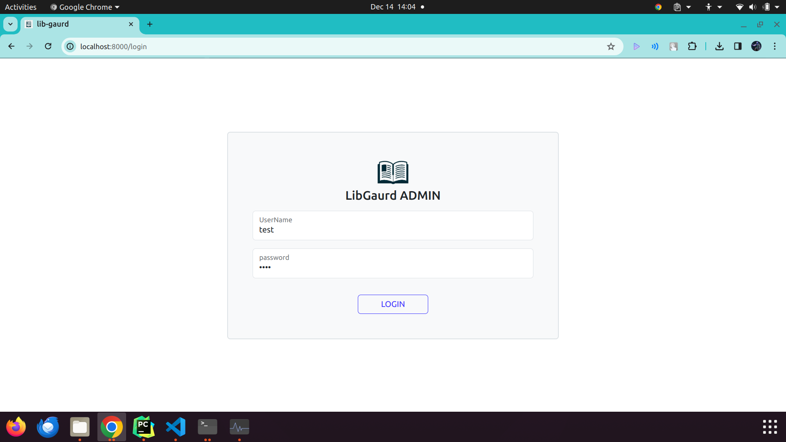
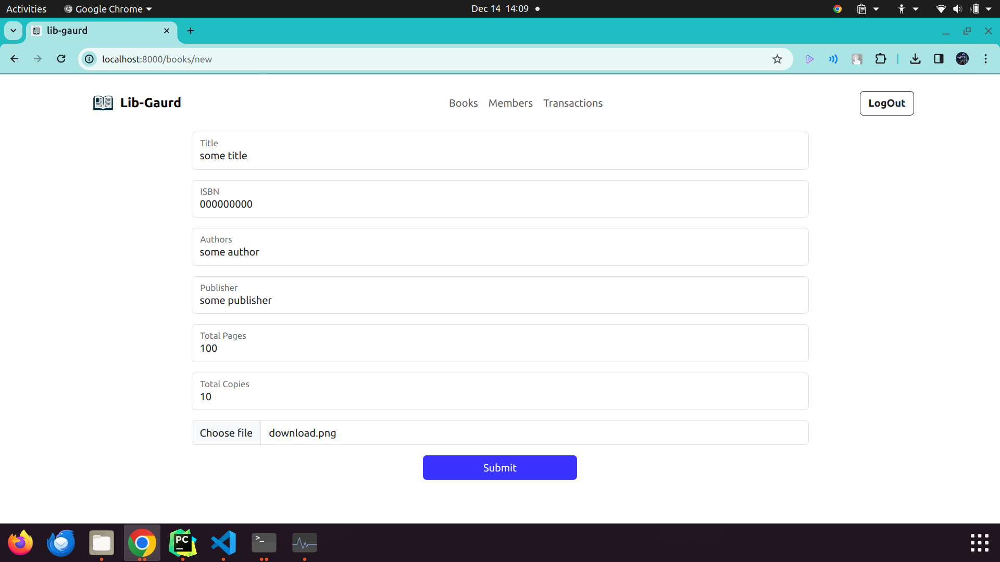
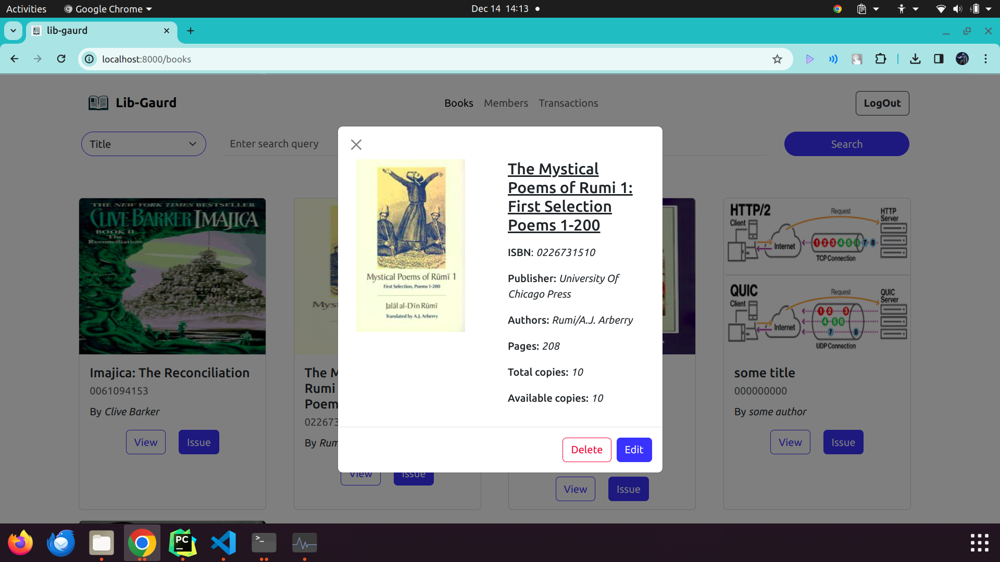
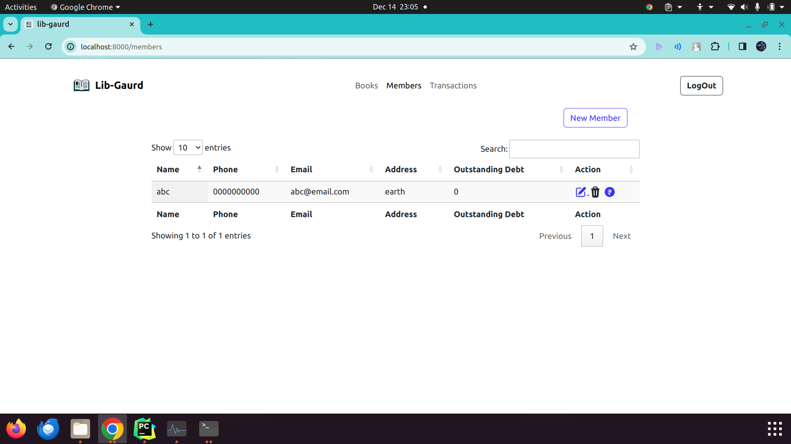
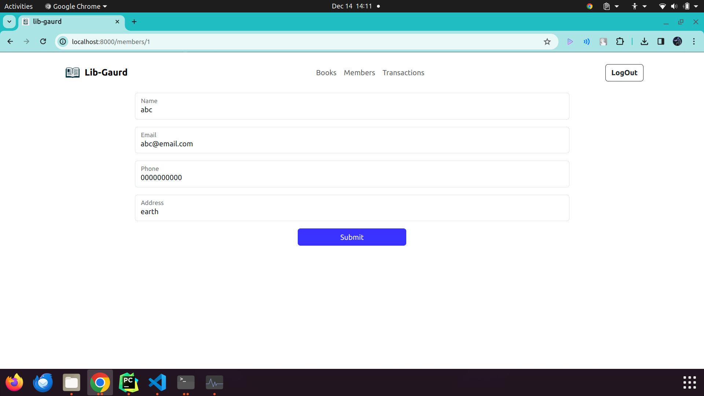
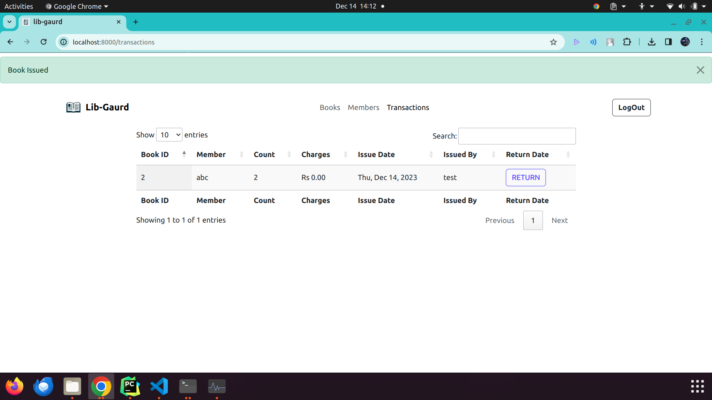

# LibGaurd - Library Management Application

**LibGaurd** helps to manage your library with ease.

---

### Features
- Search books by title, author, isbn, publisher
- Add / Edit / Delete books
- Import books from Frappe API
- Add / Edit / Delete members
- View books transactions
- Issue / Return books

### Live Demo
Check out the live demo here - 

*Test Credentials*
 - *Username*: `test`
 - *Password*: `test`

### Installation
-   #### Using Docker
    - Clone the repo
        ```bash
      git clone https://github.com/cAmartya/lib-gaurd.git
      ```
    
    - Run the following command
        ```bash
        sudo docker compose up
        ```
    - Visit http://localhost:8000

-   #### Using Python
    - Clone the repo
        ```bash
      git clone https://github.com/cAmartya/lib-gaurd.git
      ```
    
    - Copy the contents of `.env.example` to `.env`.
    - Install the python dependencies
        ```bash
        pip install -r requirements.txt
        ```
    - Run the following command
        ```bash
        python src/main.py
        ```
    - Visit http://localhost:8000

### Tech Stack
- Python
- Flask
- Flask SQLAlchemy
- Bootstrap

### Screenshots
- **Login To LibGaurd**


- **Search & List Books**


- **Add Books**


- **Import Books**


- **Show Book Details**


- **Issue Book**


- **Members List**


- **Add New Member**


- **Transaction Records**


### Disclaimer
This project is a part of the [Frappe Dev Hiring Test](https://frappe.io/dev-hiring-test).